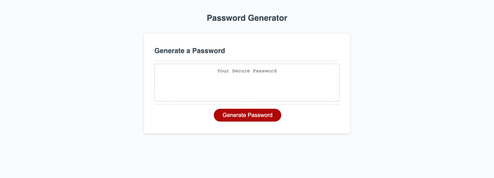

# JavaScript-Password-Generator

https://stefanpodz303.github.io/JavaScript-Password-Generator/

## Description and Purpose of Work

-Built a randomized password generator using provided HTML/CSS code and minimal JS code.

-I programmed it to prompt the user to answer a series of questions as to what their preferences are when creating a random password. For example, how many characters would they like it to be and what kinds of characters would they like in it?

-Once the user has answered the questions with their preferences a random password is generated for them. 